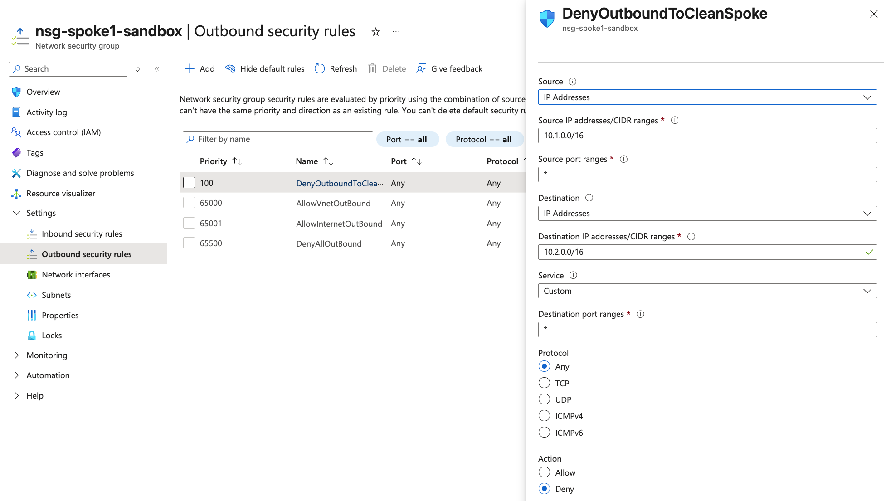

# Enterprise Cloud Landing Zone: Automated Hub-and-Spoke Architecture

## Executive Summary
This project implements a production-grade **Hub-and-Spoke network topology** in Microsoft Azure using a "Configuration-over-Code" approach. It demonstrates enterprise-scale networking, zero-trust security principles, and modern CI/CD practices using OpenID Connect (OIDC) for secretless authentication.

## The Problem (Business Context)
In a corporate environment, unverified software or "dirty" data should never be handled on the same network as sensitive production workloads. This project solves this by creating an isolated **Sandbox Spoke** for risky activities, separated from a **Clean Spoke** by a central **Hub**, with explicit security rules preventing lateral movement.

## Architecture & Security
- **Hub VNet:** Centralized entry point for management and shared services.
- **Spoke 1 (Sandbox):** Isolated environment for testing untrusted scripts/software.
- **Spoke 2 (Clean):** Secure environment for sensitive consulting data.
- **Security:** Network Security Groups (NSGs) enforce a strict "Deny All" outbound policy from the Sandbox to the Clean environment to contain potential breaches.

### Live Azure Topology

### Enforced Security Rules

## Technical Highlights
- **Infrastructure as Code:** 100% defined in Terraform.
- **CI/CD Automation:** Deployed via GitHub Actions on every `git push`.
- **Zero-Trust Security:** Utilizes **OIDC Federated Identity** to eliminate the need for static passwords/secrets in GitHub.
